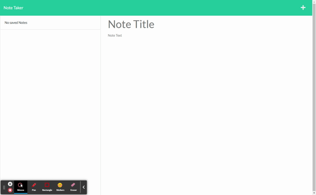

# Express Note Taker



## Table of Contents
  
* [Description](#description)
* [Installation](#installation)
* [Usage](#usage)
  
## Description
  
This app runs an instance of express to serve a note taking app. It also runs uuid to ensure that each note has a unique identifier that can be accessed or deleted.
      
## Installation
  
```npm install```
## Usage
  
If running this yourself run ```npm start``` and visit http://localhost:3001 in your browser. From there your notes are stored in a local json file.
      
## Questions

Find me on Github at https://github.com/dcrlsn/

Any Questions please contact me at
carlson.daniel.j@gmail.com